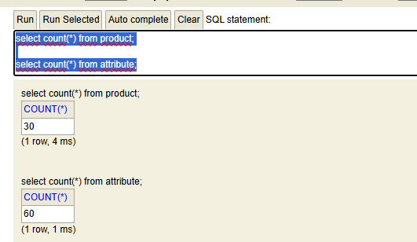
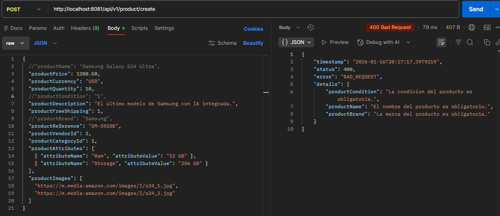
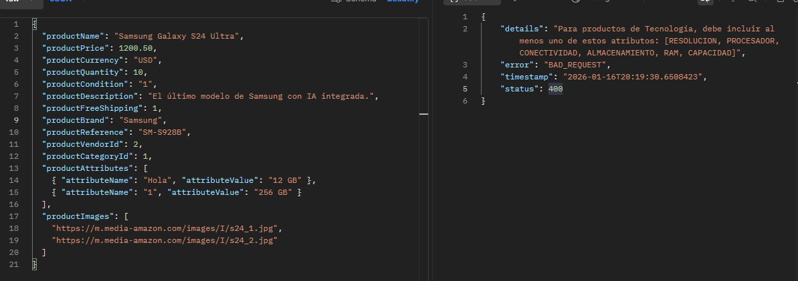
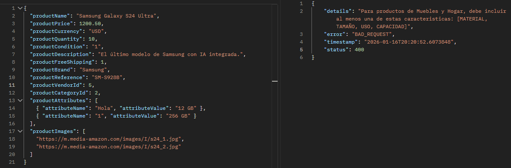
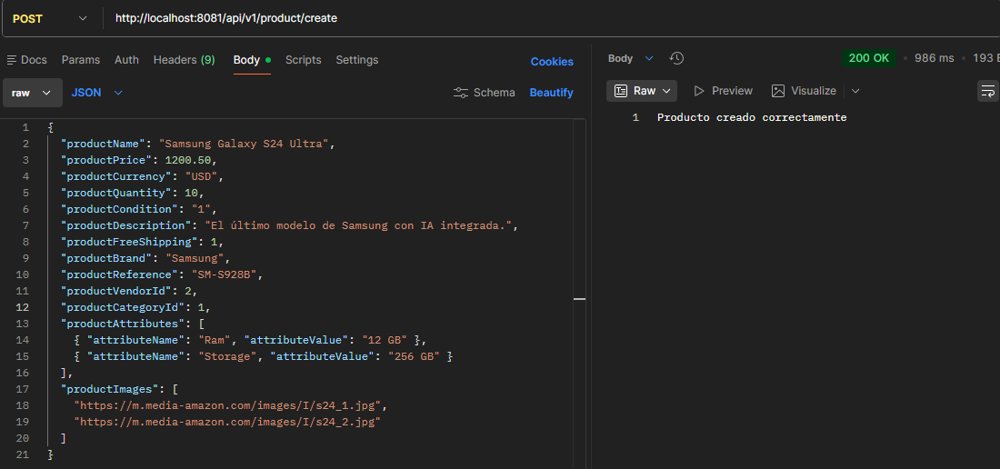
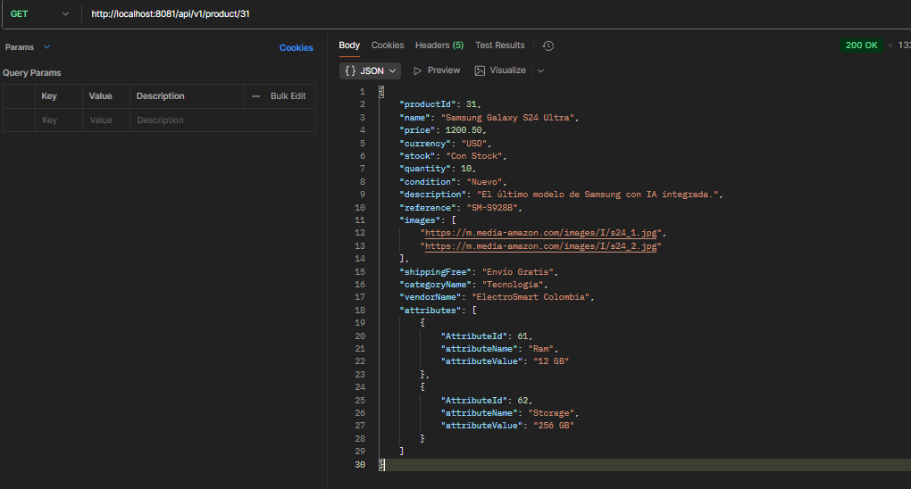
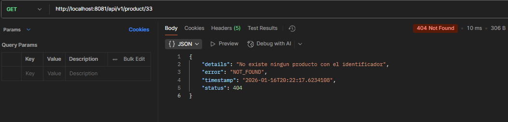
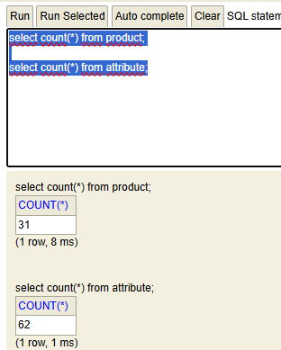

# Challenge - Backend Developer

Este proyecto es una REST API de alto rendimiento desarrollada con Java 21 y Spring Boot 3. La aplicación está diseñada para la gestión eficiente de productos, optimizando la capacidad de respuesta mediante el uso de hilos virtuales, estrategias de caché avanzadas y una arquitectura basada en patrones de diseño robustos.

###  🚀 Stack Tecnológico
* **Lenguaje:** Java 21 (LTS)
* **Framework:** Spring Boot 3.2.5
* **Gestión de Concurrencia:** Virtual Threads (Project Loom)
* **Caché:** Caffeine Cache + Spring Cache Abstraction
* **Documentación:** OpenAPI / Swagger UI
* **Base de Datos:** H2 (Persistencia en memoria/local)
* **Pruebas:** JUnit 5, Mockito

### 🛠️ Características Principales

* 🧵 **Concurrencia con Virtual Threads:**
  Se habilitó la propiedad spring.threads.virtual.enabled=true.

  **Impacto:** A diferencia del modelo tradicional de hilos de plataforma, los Virtual Threads son ligeros y permiten que la API escale masivamente bajo carga pesada, manejando miles de peticiones concurrentes con un uso de memoria significativamente menor.

```properties
spring.threads.virtual.enabled=true
```

* ⚡ **Optimización de Consultas y Caché Caffeine Cache:**
  Se implementó una capa de caché local para los endpoints de consulta (GET), reduciendo drásticamente la latencia y evitando llamadas innecesarias a la base de datos para datos de lectura frecuente.

**Configuracion de Cache** `CacheConfig`
```java
@Configuration
@EnableCaching
public class CacheConfig {

    @Bean
    public CacheManager cacheManager(){
        CaffeineCacheManager manager = new CaffeineCacheManager(
                "productById","productsPage","categoryById","vendorById","vendorByIdAndVendorCategory"
        );

        manager.setCaffeine(
                Caffeine.newBuilder()
                        .expireAfterWrite(Duration.ofMinutes(5))
                        .maximumSize(5000)

        );

        return manager;
    }
}
```

Uso del cache en los metodos `getCategoryById, getProductById, getAllProducts, getById, getVendorByIdAndVendorCategory` de los servicios `CategoryServiceImpl, ProductServiceImpl, VendorServiceImpl`

* `CategoryServiceImpl`

Se registra la **Key** `categoryById`, el cual sera buscado por Spring en el cache mediante el `ID`, en caso no de encontrarlo, va a la Base de datos y tambien lo registra en el cache por si hay una segunda llamada.
```java
  @Override
  @Cacheable(
          value = "categoryById",
          key = "#id",
          unless = "#result == null"
  )
  @Transactional(readOnly = true)
  public CategoryResponseDto getCategoryById(Long id) {
      return categoryRepository.findById(id)
              .map(categoryMapper::toResponseDto)
              .orElseThrow(() ->
                      new NoSuchResourceFoundException("La categoria no existe"));

  }
```

* `ProductServiceImpl`
  Se registran las **Key** `productById` y `productsPage`, las cuales usara Spring en el cache mediante el `ID` en caso de ejecutarse el metodo `getProductById(Long id)`, en caso no de encontrarlo, va a la Base de datos y tambien lo registra en el cache por si hay una segunda llamada, para el metodo `getAllProducts(Pageable pageable)`, se registra en cache los parametros de la busqueda en este caso, paginacion, tamaño y ordenamiento.
```java
  @Override
  @Cacheable(
          value = "productById",
          key = "#id",
          unless = "#result == null"
  )
  @Transactional(readOnly = true)
  public ProductResponseDto getProductById(Long id) {
      return productRepository.findById(id)
              .map(productMapper::toResponseDto)
              .orElseThrow(() ->
                      new NoSuchResourceFoundException("No existe ningun producto con el identificador"));
  }

  @Override
  @Cacheable(
          value = "productsPage",
          key = "T(java.lang.String).format('%s-%s-%s', #pageable.pageNumber, #pageable.pageSize, #pageable.sort)"
  )
  @Transactional(readOnly = true)
  public Page<ProductResponseDto> getAllProducts(Pageable pageable) {
      return productRepository.findAll(pageable)
              .map(productMapper::toResponseDto);
  }
```

* `VendorServiceImpl`
  Se registran las **Key** `vendorById` y `vendorByIdAndVendorCategory`, estas seran usadas por sprint en caso de una solicitud, si el resultado aun no se enceuntra en cache, se registra, de lo contrario va directo a la base de datos.
```java
  @Override
  @Cacheable(
          value = "vendorById",
          key = "#id",
          unless = "#result == null"
  )
  @Transactional(readOnly = true)
  public VendorResponseDto getById(Long id) {
      return vendorRepository.findById(id)
              .map(vendorMapper::toResponseDto)
              .orElseThrow(() -> new NoSuchResourceFoundException("El vendedor no existe"));
  }

  @Override
  @Cacheable(
          value = "vendorByIdAndVendorCategory",
          key = "#id",
          unless = "#result == null"
  )
  @Transactional(readOnly = true)
  public VendorResponseDto getVendorByIdAndVendorCategory(Long id, Long categoryId) {
      return vendorRepository.getByIdAndVendorCategory_Id(id, categoryId)
              .map(vendorMapper::toResponseDto)
              .orElseThrow(() -> new NoSuchResourceFoundException("El vendedor no existe para esa categoria"));

  }
```
**Solución al Problema N+1:** Se utilizó EntityGraph en la capa de persistencia (JPA). Esto permite realizar un fetch join optimizado, obteniendo la entidad y sus relaciones en una sola consulta SQL, mejorando el rendimiento en comparación con la carga perezosa (lazy loading) convencional.

```java
@Repository
public interface ProductRepository extends JpaRepository<Product, Long> {
    @EntityGraph(attributePaths = {
            "productAttributes",
            "productCategory",
            "productVendor"
    })
    Page<Product> findAll(Pageable pageable);
}
```


* 🏗️ **Patrones de Diseño: Strategy & Factory**
  Para la creación de productos, se implementó una lógica que exige atributos específicos según la categoría del producto.

**Diseño:** Se utilizó el patrón Strategy combinado con un Factory. Esto permite que el sistema seleccione dinámicamente la lógica de validación y construcción adecuada, garantizando un código limpio, extensible y fácil de mantener (Principios SOLID).

* `CategoryValidatorStrategy`
  Interfaz strategy para la validacion de atributos para una categoria de producto
```java
public interface CategoryValidatorStrategy {
    void validateCategory(List<AttributeRequestDto> attributeRequestDtos);
}
```

* `CategoryValidatorFactory`
  Clase Factory que determina por medio del nombre de la categoria del producto que estrategis de validacion de atributos debe instanciar, si la categoria no coincide con las existentes. instancia una clase de validacion por defecto.
```java
@Component
public class CategoryValidatorFactory {

    private static final Map<String, CategoryValidatorStrategy> strategyMap = new HashMap<>();

    static {
        strategyMap.put(Constants.TECNOLOGI_CATEGORY, new TechnologieCategoryValidator());
        strategyMap.put(Constants.FURNITURE_CATEGORY, new FurnitureCategoryValidator());
        strategyMap.put(Constants.DEPORTS_FITNESS_CATEGORY, new DeportsFitnessCategoryValidator());
    }

    public CategoryValidatorStrategy getCategoryValidatorStrategy(String categoryName){
        return strategyMap.getOrDefault(categoryName.toUpperCase(), new DefaultCategoryValidator());
    }
}
```

* `TechnologieCategoryValidator`
  Implementacion de la validacion para la categoria productos de **Tecnologia**
```java
@Component
public class TechnologieCategoryValidator implements CategoryValidatorStrategy {

    private static final Set<String> TECH_ATTRIBUTES = Set.of(
            "RAM", "PROCESADOR", "ALMACENAMIENTO",
            "RESOLUCION", "CONECTIVIDAD", "CAPACIDAD"
    );

    @Override
    public void validateCategory(List<AttributeRequestDto> attributeRequestDtos) {
        if(attributeRequestDtos == null || attributeRequestDtos.isEmpty()){
            throw new InvalidAttributeException(Messages.CATEGORY_TECHNOLOGY_MESSAGE);
        }

        boolean hasRequiredAttributes = attributeRequestDtos.stream()
                .map(attr -> attr.attributeName().toUpperCase())
                .anyMatch(TECH_ATTRIBUTES::contains);

        if(!hasRequiredAttributes){
            throw new InvalidAttributeException(Messages.INVALID_CATEGORY_TECHNOLOGY_MESSAGE+TECH_ATTRIBUTES);
        }
    }
}
```


### 📖 Documentación de la API
Una vez que la aplicación esté en ejecución, puedes explorar y probar los endpoints desde la interfaz interactiva: **Swagger UI:** http://localhost:8081/swagger-ui.htmlEndpoints

**_Endpoints Principales_**

| **Metodo** | **Endpoint** | **Descripción** |
|--------------|--------------|--------------|
| **_POST_**      | **_/api/v1/product/create_**     | Crea un producto validando atributos según su categoría.      |
| **_GET_**      | **_/api/v1/product_**      | Lista todos los productos con paginación y ordenamiento (Cacheable).      |
| **_GET_**      | **_/api/v1/product/{id}_**      | Busca un producto específico por su ID (Cacheable).      |

### ⚙️ Configuración y Ejecución
**Requisitos**

* JDK 21
* Maven

### Instalación y Arranque
* **Clonar el repositorio:**
```bash
git clone https://github.com/Kevin-Jimenez/Challenge-BackendDeveloper-MELI.git
cd Challenge-BackendDeveloper-MELI
```

* **Construir el proyecto:**
```bash
./mvnw clean install
```
* **Ejecutar la API:**
```bash
./mvnw spring-boot:run
```
### Ejemplos de la Ejecucion
* Base de datos apenas sube la aplicacion con unos productos inciales.



* Envio creacion de un producto con campos faltantes.



* Envio creacion de un producto con atributos que no corresponden a la categoria de Tecnologia, para ver en accion la strategy de validacion.



* Envio creacion de un producto con atributos que no corresponden a la categoria de Muebles y Hogar.



* Creacion correcta de un producto


* Obtener producto por ID, el que se acaba de crear.


* Obtener producto por ID, el producto no existe.


* Obtener todos los productos, paginado.


* Base de datos final, con el producto creado.

